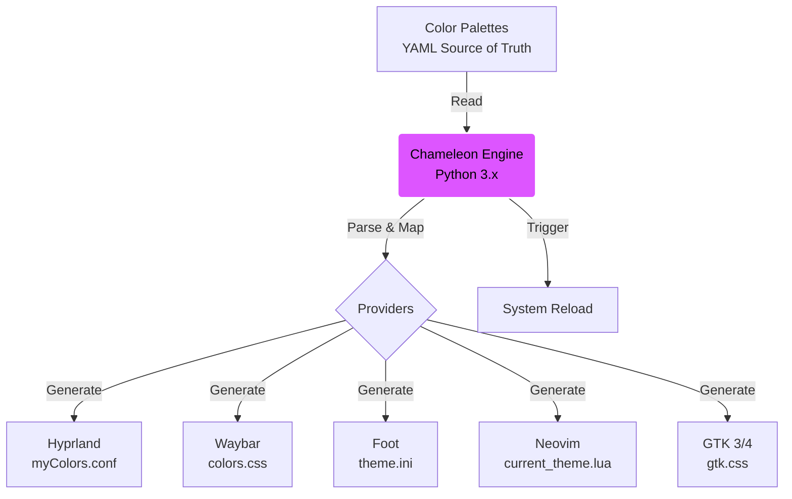

# Dotfiles (SANXZ Environment)

A infraestrutura como código do meu ambiente de desenvolvimento pessoal (Arch Linux & Raspberry Pi).

## 🔧 Arquitetura

Este repositório utiliza **GNU Stow** para gerenciar symlinks de forma modular e limpa.

### Estrutura de Perfis
*   **`common/`**: Configurações universais (Neovim, Zsh, temas). Aplicado em todas as máquinas.
*   **`note/`**: Configurações específicas para o Laptop (Arch Linux, Monitor 1080p, Hardware Graphics).
*   **`pi/`**: Configurações otimizadas para Raspberry Pi (ARM, Scaling Nativo, Leveza).
    > [Ver Guia de Setup do Pi (RGB Fix & Tuning)](common/docs/RASPBERRY_PI_SETUP.md)

### Fluxo de Dados (Chameleon Engine)


## 🎨 Temas & Identidade Visual (v2.7)
O ecossistema utiliza a engine **Chameleon** para gerenciar 5 temas remasterizados com lógica de "Segurança Semântica":

*   **Semiótica Humanizada:** Interface modernizada com Emojis semânticos na Waybar (🧠 CPU, 💭 RAM, 🌡️ Temp), trocando ícones técnicos por metáforas biológicas/cognitivas.
*   **SANXZ4 (Flagship):** Violet-Base Dark Rainbow com lógica P-W-C-W (Intercalada).
*   **Monored:** Escala monocromática vermelha (Sith/Focus).
*   **Green Hill:** Escala monocromática verde (Matrix/CRT).
*   **CoolWarm / WarmCool:** Lógica psicológica de "Ação vs Estrutura" com base Rainbow.

### Core Features
*   **Semantic Safety Shield:** Alertas de Erro (Vermelho), Sucesso (Verde) e Info (Azul) são **imutáveis** e blindados em todos os temas, garantindo segurança cognitiva para operações de SRE.
*   **Polimorfismo:** O Chameleon gera configs para:
    *   **Hyprland & Waybar:** (Com ciclo de 10 workspaces vibrantes).
    *   **Shell (Zsh):** Prompt, Syntax Highlighting, LS_COLORS.
    *   **Apps:** Foot, Neovim, Wofi.
    *   **GUI:** GTK 3/4 (CSS Injection) e **Chromium** (Manifests nativos).

> Consulte a [Teoria das Cores SANXZ](common/docs/SAN_COLORS.md) para detalhes técnicos.

## 🛠️ Automação SRE
*   **Centralização:** Variáveis de ambiente e Autostart movidos para arquivos globais (`environment.conf`, `base.conf`) para evitar duplicação e conflitos de dependência.
*   **Neural Link (KVM):** Controle remoto de periféricos (Teclado/Mouse) via **Pipe SSH direto** (sem Netcat), acionado pelo alias `KVM` no terminal para máxima estabilidade.
*   **Smart Audio:** Perfis de compressão dinâmica (Baby Mode vs Regular) gerenciados via script e atalhos.
*   **Sync:** Fluxo de trabalho GitOps rigoroso (Edita no Arch -> Push -> Pull no Pi).
*   **Documentação:** Guias técnicos (ex: `hyprctl dispatch`) versionados junto com a config.

## Como Instalar

```bash
git clone https://github.com/devsanxz/dotfiles.git ~/dotfiles
cd ~/dotfiles
stow -R common <perfil_da_maquina>
```

---
*"As coisas são só as coisas, Case."*