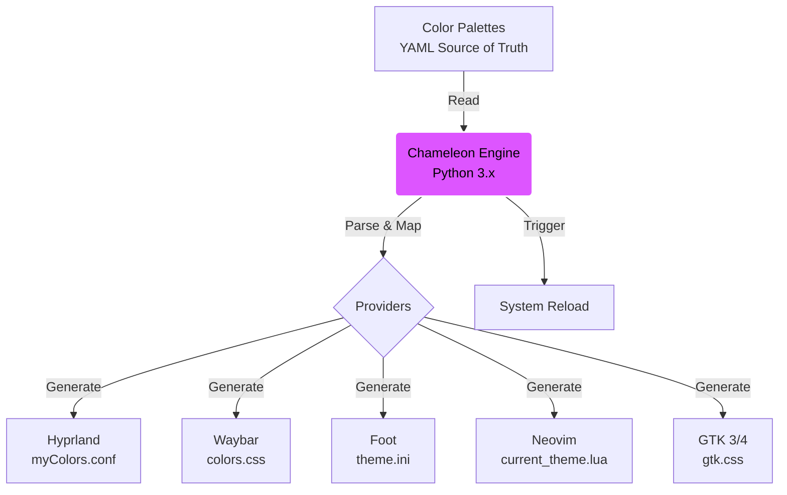

# Dotfiles (SANXZ Environment)

A infraestrutura como código do meu ambiente de desenvolvimento pessoal (Arch Linux & Raspberry Pi).

## 🔧 Arquitetura

Este repositório utiliza **GNU Stow** para gerenciar symlinks de forma modular e limpa.

### Estrutura de Perfis
*   **`common/`**: Configurações universais (Neovim, Zsh, temas). Aplicado em todas as máquinas.
*   **`note/`**: Configurações específicas para o Laptop (Arch Linux, Monitor 1080p, Hardware Graphics).
*   **`pi/`**: Configurações otimizadas para Raspberry Pi (ARM, Scaling Nativo, Leveza).

### Fluxo de Dados (Chameleon Engine)


## 🎨 Tema SANXZ4
Uma identidade visual unificada e proprietária, aplicada transversalmente.
> Consulte a [Teoria das Cores SANXZ](common/docs/SAN_COLORS.md) para detalhes técnicos sobre a paleta e filosofia.

*   **Neovim:** Temas `sanxz4`, `sanxzmonored`, `sanxzwarmcool`, `sanxzcoolwarm`.
*   **Hyprland & Waybar:** Variáveis globais centralizadas em `myColors.conf`.
*   **Shell:** Zsh prompt e highlighting (Swap White/Violet).
*   **Chromium:** Tema customizado "unpacked".

A paleta segue uma lógica de cores quentes/frias para separar *Ação* de *Estrutura*.

## 🛠️ Automação SRE
*   **Centralização:** Variáveis de ambiente e Autostart movidos para arquivos globais (`environment.conf`, `base.conf`) para evitar duplicação e conflitos de dependência.
*   **Sync:** Fluxo de trabalho GitOps rigoroso (Edita no Arch -> Push -> Pull no Pi).
*   **Documentação:** Guias técnicos (ex: `hyprctl dispatch`) versionados junto com a config.

## Como Instalar

```bash
git clone https://github.com/devsanxz/dotfiles.git ~/dotfiles
cd ~/dotfiles
stow -R common <perfil_da_maquina>
```

---
*"As coisas são só as coisas, Case."*